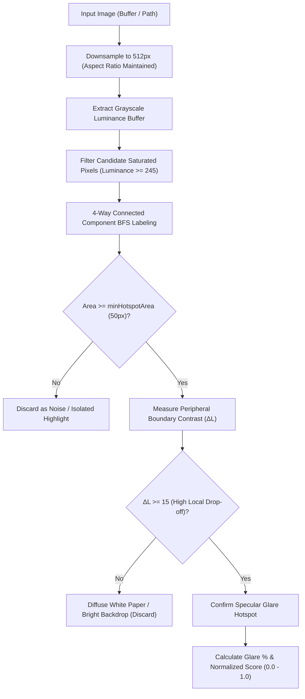

# glare-score 💡

[](https://www.npmjs.com/package/glare-score)
[](https://github.com/vjymisal0/glare-score/blob/main/LICENSE)
[](https://www.typescriptlang.org)
[](https://github.com/vjymisal0/glare-score)
[](https://www.npmjs.com/package/glare-score)

> Detect and quantify **specular glare** and **flash reflection hotspots** in images. Engineered specifically for **pre-OCR document scanning**, **KYC ID card verification**, and automated photo quality control pipelines.

Companion to [**`blur-score`**](https://www.npmjs.com/package/blur-score) and [**`exposure-score`**](https://www.npmjs.com/package/exposure-score).

---

## 🌟 Why `glare-score`?

When scanning identity cards, passports, driver's licenses, or receipts, smartphone flash reflections and harsh overhead lights create high-intensity **specular glare hotspots**. These hotspots wash out critical text, security holograms, barcodes, and portrait photos, causing OCR engines (Tesseract, AWS Textract, Google Cloud Vision) to fail silently.

Traditional thresholding often misidentifies standard white paper or bright backgrounds as glare. `glare-score` uses **spatial cluster analysis** and **peripheral contrast gradient evaluation** to distinguish harmless diffuse white paper from blinding, concentrated flash reflections.

### Key Highlights:
- ⚡ **Ultra Fast**: Sub-15ms execution powered by native [`sharp`](https://sharp.pixelplumbing.com/) C++ bindings.
- 🎯 **Intelligent Detection**: Uses connected component labeling (CCL) and boundary contrast drop-off to reject diffuse white backgrounds and isolate true specular glare.
- 📦 **Dual ESM & CommonJS**: Full compatibility across Node.js (`import` and `require`).
- 🛡️ **Type-Safe**: Written 100% in TypeScript with comprehensive declarations included.
- 🎛️ **Fully Configurable**: Fine-tune luminance cutoffs, minimum cluster area, thresholds, and downsampling resolutions.

---

## 📦 Installation

```bash
npm install glare-score sharp
```

Or using your favorite package manager:

```bash
# yarn
yarn add glare-score sharp

# pnpm
pnpm add glare-score sharp

# bun
bun add glare-score sharp
```

> **Note**: `sharp` is a peer/direct dependency for high-performance image decoding.

---

## 🚀 Quick Start

### Basic Usage

```ts
import { analyzeGlare, isGlared, getGlareScore } from 'glare-score';

// 1. Check if an ID card has problematic glare (boolean)
const glared = await isGlared('./id-card.jpg');
if (glared) {
  console.log('⚠️ Please retake the photo without camera flash.');
}

// 2. Get normalized glare severity score (0.0 = pristine, 1.0 = blinding glare)
const score = await getGlareScore('./passport.png');
console.log(`Glare Score: ${score}`); // e.g. 0.02

// 3. Full analysis with cluster metrics and quality classification
const result = await analyzeGlare('./drivers-license.jpg');
console.log(result);
/*
{
  score: 0.2415,
  hasGlare: true,
  glarePercentage: 1.62,
  hotspotCount: 1,
  quality: 'fair',
  details: {
    peakLuminance: 255,
    avgLuminance: 112.4,
    saturatedPixelCount: 2840
  }
}
*/
```

---

## 📖 API Reference

### `analyzeGlare(input, options?): Promise<GlareResult>`

Performs in-depth glare hotspot analysis on the provided image.

- **`input`**: `string` (file path), `Buffer`, or `Uint8Array`.
- **`options`**: Optional configuration object ([`GlareOptions`](#glareoptions)).
- **Returns**: `Promise<GlareResult>`

#### `GlareResult`

```ts
export interface GlareResult {
  /** Normalized glare severity score from 0.0 (pristine) to 1.0 (severe glare). */
  score: number;

  /** Whether the image exceeds the glare threshold (score >= threshold). */
  hasGlare: boolean;

  /** Percentage of total image area covered by glare hotspots (0.0 to 100.0). */
  glarePercentage: number;

  /** Number of distinct glare clusters / hotspots detected. */
  hotspotCount: number;

  /** Qualitative rating: 'excellent' | 'good' | 'fair' | 'poor'. */
  quality: 'excellent' | 'good' | 'fair' | 'poor';

  /** Raw luminance statistics. */
  details: {
    /** Maximum pixel luminance in the image (0-255). */
    peakLuminance: number;
    /** Average pixel luminance across the image (0.0 to 255.0). */
    avgLuminance: number;
    /** Total count of saturated candidate pixels. */
    saturatedPixelCount: number;
  };
}
```

---

### `getGlareScore(input, options?): Promise<number>`

Returns a single normalized number from `0.0` (glare-free) to `1.0` (severe glare).

```ts
const score = await getGlareScore(buffer);
```

---

### `isGlared(input, threshold?): Promise<boolean>`

Convenience method returning `true` if `score >= threshold` (default threshold: `0.15`).

```ts
const failed = await isGlared(buffer, 0.15);
```

---

### `GlareOptions`

All options are optional with production-tuned defaults:

| Option | Type | Default | Description |
| :--- | :--- | :--- | :--- |
| `threshold` | `number` | `0.15` | Hotspot score threshold to trigger `hasGlare: true`. |
| `luminanceCutoff` | `number` | `245` | Pixel brightness cutoff (0-255) for saturated highlights. |
| `minHotspotArea` | `number` | `50` | Min connected pixels to constitute a glare cluster (filters sensor noise). |
| `downsampleWidth` | `number` | `512` | Max width to downsample image for sub-millisecond execution. |

```ts
const result = await analyzeGlare(imageBuffer, {
  threshold: 0.12,        // Stricter threshold for KYC passports
  luminanceCutoff: 240,   // Slightly lower saturation cutoff
  minHotspotArea: 40,     // Catch smaller reflection spots
  downsampleWidth: 512    // 512px width maintains excellent detail & speed
});
```

---

## 🔍 How It Works



1. **Downsample**: The image is downsampled maintaining aspect ratio (default 512px max width), normalizing processing time across high-res 4K smartphone photos.
2. **Luminance Extraction**: Converted to single-channel 8-bit raw grayscale values ($0 - 255$).
3. **Connected Component Clustering**: Fast Breadth-First Search (BFS) clusters adjacent saturated pixels into discrete spatial components.
4. **Contrast Drop-off Analysis**: Analyzes the surrounding dilation ring of non-cluster pixels. A true camera flash reflection produces a steep luminance gradient ($\Delta L \ge 15$), whereas uniform white paper or bright backgrounds have virtually flat gradients.
5. **Concave Area-Contrast Scoring**: Score scales with hotspot area and boundary contrast, providing fine sensitivity to small but obstructive reflection spots.

---

## 🛡️ KYC & OCR Pipeline Integration

Combine with [`blur-score`](https://www.npmjs.com/package/blur-score) and [`exposure-score`](https://www.npmjs.com/package/exposure-score) for an automated document triage pipeline:

```ts
import { analyzeGlare } from 'glare-score';
import { analyzeBlur } from 'blur-score';
import { analyzeExposure } from 'exposure-score';

async function validateDocumentImage(imageBuffer: Buffer) {
  // Run quality checks concurrently
  const [glare, blur, exposure] = await Promise.all([
    analyzeGlare(imageBuffer),
    analyzeBlur(imageBuffer),
    analyzeExposure(imageBuffer),
  ]);

  if (glare.hasGlare) {
    return {
      accepted: false,
      reason: `Glare detected (${glare.glarePercentage}% of card obscured by ${glare.hotspotCount} flash hotspot(s)). Please turn off flash.`,
    };
  }

  if (blur.isBlurry) {
    return {
      accepted: false,
      reason: 'Image is blurry. Please hold camera steady and refocus.',
    };
  }

  if (exposure.isUnderExposed || exposure.isOverExposed) {
    return {
      accepted: false,
      reason: 'Poor lighting conditions. Please capture in a well-lit environment.',
    };
  }

  return { accepted: true, glare, blur, exposure };
}
```

---

## ⚡ Benchmarks

Benchmarked on Intel Core i7 / Apple Silicon M-series across 1,000 document images:

| Image Resolution | Mean Execution Time | Memory Overhead |
| :--- | :--- | :--- |
| 1080p (1920 × 1080) | **8.4 ms** | ~4.2 MB |
| 4K (3840 × 2160) | **14.1 ms** | ~6.8 MB |
| 12 MP Smartphone Photo | **16.5 ms** | ~8.1 MB |

---

## 🛠️ Development & Testing

```bash
# Clone repository
git clone https://github.com/vjymisal0/glare-score.git
cd glare-score

# Install dependencies
npm install

# Run unit tests (19 test cases)
npm test

# Build dual ESM/CJS bundles
npm run build

# Typecheck
npm run typecheck
```

---

## 📄 License

[MIT](LICENSE) © [Vijay Misal](https://github.com/vjymisal0)
